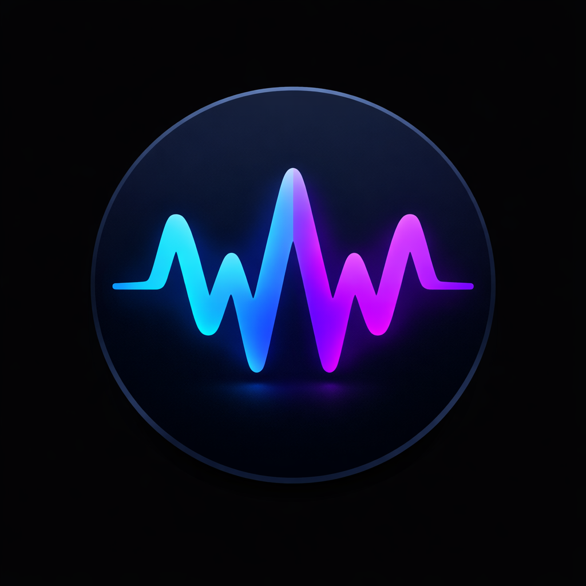

# Wavox

<div align="center">

  

[](https://www.python.org/)
[](https://kit.svelte.dev/)
[](https://nodejs.org/)
[](https://redis.io/)
[](https://docs.docker.com/compose/)
[](LICENSE)

</div>

Wavox is a self-hosted Discord music bot platform with a real-time web dashboard. It combines Discord voice playback, YouTube and Spotify intake, synchronized lyrics, playback analytics, and a Svelte-based control surface backed by Node and Redis.

The project is designed as an operational stack rather than a single bot process: the bot handles voice and command execution, while the SvelteKit frontend also owns OAuth, REST APIs, WebSocket fan-out, and the browser-facing dashboard.

## Overview

- Discord music playback with queue, seek, loop, shuffle, previous, and now-playing controls
- YouTube search and direct playback through `yt-dlp`
- Spotify track, album, and playlist intake resolved into playable sources
- Real-time dashboard with WebSocket-driven playback state and lyrics updates
- Per-user and per-guild listening analytics backed by SQLite
- Docker Compose deployment with Redis, bot, and frontend services

## Architecture

Wavox is split into three runtime services:

1. `discord-bot`: executes slash commands, joins voice channels, resolves tracks, and streams audio
2. `web-frontend`: SvelteKit application for the user dashboard, OAuth, REST APIs, docs pages, and WebSocket fan-out
3. `redis`: message bus for command dispatch and state/event distribution

```text
Discord Users
    |
    +-- Slash commands / text commands --> discord-bot
    |                                         |
    |                                         +-- yt-dlp / Spotify resolution
    |                                         +-- voice playback
    |                                         +-- SQLite analytics writes
    |                                         +-- Redis state + command bus
    |
    +-- Browser --> web-frontend --> Redis --> discord-bot
                               |
                               +-- OAuth, session cookies, APIs, WebSockets
```

For a deeper breakdown, see [docs/architecture.md](docs/architecture.md).

## Repository Layout

```text
.
|-- app/                 # Discord bot, playback engine, media services, analytics
|-- web/                 # Legacy web assets and static docs source
|-- web-frontend/        # SvelteKit dashboard frontend
|-- docker-compose.yaml  # Multi-service local/prod orchestration
|-- Dockerfile           # Discord bot image
|-- requirements.txt     # Bot dependencies
`-- Makefile             # Common Docker Compose tasks
```

## Key Features

### Music Playback

- `/play` supports search terms, direct URLs, Spotify tracks, playlists, and albums
- Queue management with `/queue`, `/skip`, `/clear`, `/previous`, `/shuffle`
- Time-aware playback controls with `/pause`, `/resume`, `/goto`, `/loop`, `/stop`
- Playback state is distributed in real time through Redis and WebSocket events

### Dashboard

- Discord OAuth login flow
- Guild selection for servers where the user has access and the bot is active
- Live playback state, queue visualization, and synchronized lyrics
- Profile and admin-oriented overview pages powered by backend APIs

### Analytics and Utility Commands

- Recent plays, top tracks, most active users, and user listening status
- Lyrics lookup, clip extraction, and audio download helpers
- SQLite persistence with WAL mode for lightweight embedded analytics

## Supported Commands

### Music

| Slash Command | Description |
|---|---|
| `/play` | Play from search, URL, Spotify track, album, or playlist |
| `/stop` | Stop playback, clear queue, and disconnect |
| `/skip` | Skip current track or jump to a queue position |
| `/clear` | Clear queued tracks while keeping the current one playing |
| `/queue` | Show the current queue |
| `/pause` | Pause playback |
| `/resume` | Resume playback |
| `/goto` | Seek to a position in the current track |
| `/loop` | Cycle loop mode: `off`, `track`, `queue` |
| `/previous` | Return to the previous track |
| `/shuffle` | Shuffle queued tracks |
| `/nowplaying` | Show current track information |

### Utility

| Slash Command | Description |
|---|---|
| `/ping` | Check bot latency |
| `/clip` | Create a clip from the current song |
| `/download` | Download the current song or a searched song |
| `/lyrics` | Fetch lyrics for the current or requested song |

### Stats

| Slash Command | Description |
|---|---|
| `/recent` | Show recently played tracks |
| `/toptracks` | Show the most played tracks |
| `/mostplayed` | Show the most active users in a guild |
| `/status` | Show 30-day listening stats for a user |

Equivalent text-command aliases are also available through the configured prefix.

## Quick Start

### 1. Create a Discord Application

- Create a Discord application and bot in the Discord Developer Portal
- Enable the bot and copy its token
- Configure OAuth redirect URIs for the dashboard login flow
- Invite the bot to your server with the required permissions

The repository still includes source legal and invite docs under `web/docs/`, while the live app serves their Svelte equivalents from `/docs`.

### 2. Configure Environment Variables

Create a `.env` file in the repository root.

Minimal example:

```bash
DISCORD__TOKEN=your_discord_bot_token_here
DISCORD__CLIENT_ID=your_discord_application_client_id
DISCORD__CLIENT_SECRET=your_discord_application_client_secret
DISCORD__REDIRECT_URI=http://localhost:3000/dashboard/callback
WEB_SECRET_KEY=replace_this_with_a_strong_secret
WEB_ORIGIN=http://localhost:3000

SPOTIFY_CLIENT_ID=your_spotify_client_id
SPOTIFY_CLIENT_SECRET=your_spotify_client_secret
SPOTIFY_MARKET=US
```

See [docs/configuration.md](docs/configuration.md) for the full configuration reference.

### 3. Start the Stack

Using Make:

```bash
make deploy
```

Or directly with Docker Compose:

```bash
docker compose -f docker-compose.yaml build
docker compose -f docker-compose.yaml up -d
```

### 4. Open the Services

| Service | Default URL |
|---|---|
| Frontend dashboard | `http://localhost:3000` |
| Documentation pages | `http://localhost:3000/docs` |

In a production setup, the intended public entrypoint is a reverse proxy in front of the frontend and API services.

## Local Development

### Backend Bot

The bot container is the canonical runtime path because it includes FFmpeg and the audio dependencies expected by the project.

If you still want to run pieces manually, the application entrypoint is:

```bash
python app/main.py
```

### Frontend

Frontend scripts:

```bash
cd web-frontend
npm install
npm run dev
```

Available scripts:

| Script | Purpose |
|---|---|
| `npm run dev` | Run the SvelteKit app in development mode |
| `npm run build` | Build the production frontend |
| `npm run preview` | Preview the production build |
| `npm run check` | Run Svelte/TypeScript checks |

## Runtime Notes

- Redis is the event backbone for dashboard updates and command dispatch
- OAuth, HTTP APIs, docs pages, and WebSocket fan-out now live inside the SvelteKit/Node frontend service
- Playback state is cached per guild and streamed through WebSockets
- Lyrics are fetched through `lrclib` and sent to the dashboard separately from progress events
- SQLite stores play history and user interaction events
- The bot automatically clears stale playback state when it leaves a voice channel

## Documentation

- [docs/architecture.md](docs/architecture.md)
- [docs/configuration.md](docs/configuration.md)
- [docs/design-direction.md](docs/design-direction.md)
- [web/docs/index.md](web/docs/index.md)
- [web/docs/invite.md](web/docs/invite.md)
- [web/docs/privacy.md](web/docs/privacy.md)
- [web/docs/terms.md](web/docs/terms.md)

## License

This project is distributed under the [GNU General Public License v3.0](LICENSE).
